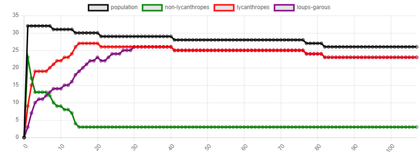
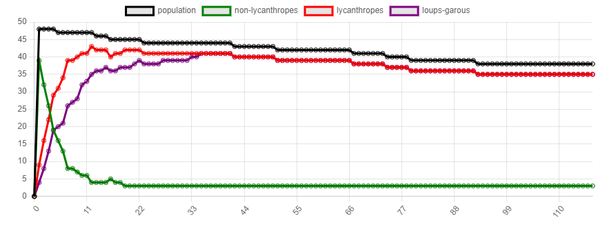
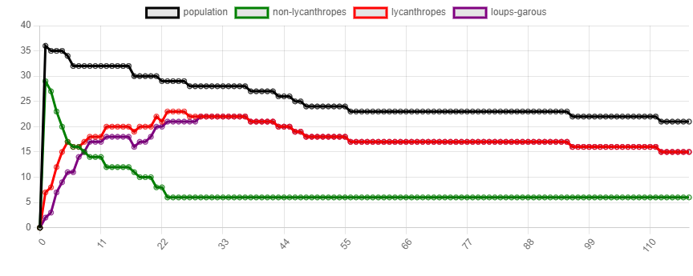
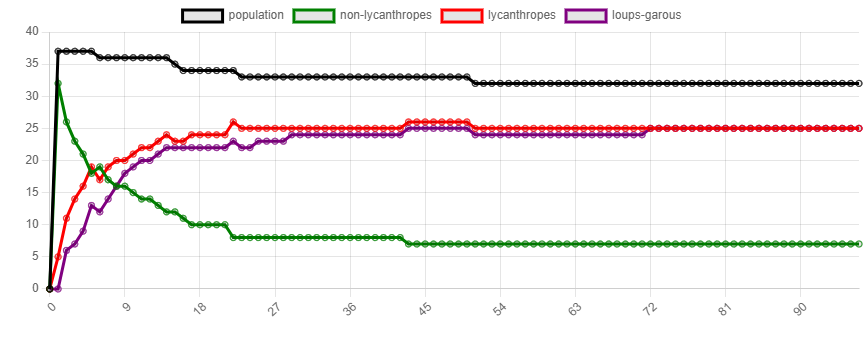
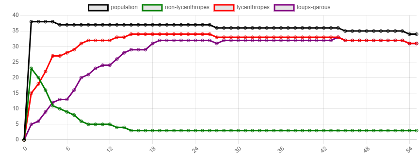
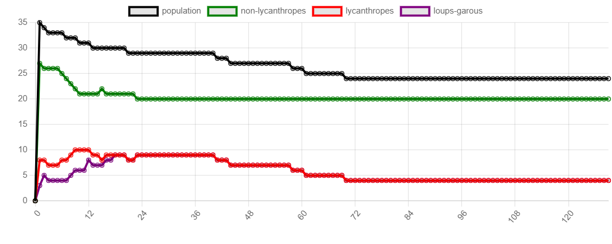

Informations supplémentaires : 
- les Apothicaires et les Chasseurs ne peuvent pas être transformés en loup-garou.
- dans mes réponses, je distingue chasseurs/apothicaires des villageois. Ainsi, l'ensemble des villageois n'inclue pas chasseurs et apothicaires.

 ## Question 1
Pour modifier l'autre agent, il faut d'abord que le loup-garou et le villageois se retrouvent à bonnes distances. Une fois cette condition vérifiée, j'ai récupéré dans la liste des agents celui que je visais puis, ayant ajouté à la classe Villager l'attribue isLycanthrope précédemment, je l'ai passé à True.
Cette méthode semble correspondre à la définition d'agent qui va évoluer dans son environnement de manière autonome (se déplace seul) et interagir avec, notamment sur les autres agents en les transformant. On a donc coordination entre les agents.

## Question 2
Avec le paramétrage de base (25 villageois, 5 lycanthropes, 2 chasseurs, 1 apothicaire, probabilité de transformation = 10%), le système converge systématiquement vers l'état suivant:
	- l'ensemble des villageois transformés en loups-garous (modulo les quelques-uns tués par les chasseurs une fois transformés)
	- les 2 chasseurs
	- l'apothicaire
On a donc systématiquement une domination des loups-garous. Etant donné que les agents se deplacent relativement peu, on peut se dire que le système restera à peu près stable mais, il reste possible en attendant très longtemps que les chasseurs finissent par tuer tous les loup-garous et qu'il ne reste que les chasseurs et l'apothicaire à la fin. De plus, je n'ai jamais pu l'observer lors de mes simulations mais il pourrait également rester quelques villageois qui seraient isolés des loups-garous.

Le nombre moyen de cycles avant convergence est de 30.

L'apothicaire (et l'augmentation du nombre d'apothicaires) aura tendance à retarder la convergence (augmenter le nombre de cycles avant convergence). Effectivement, dès qu'un villageois est infecté, il peut être soigné par l'apothicaire, rajoutant un délai avant qu'il ne soit réinfecté puis qu'il se transforme à nouveau en loup-garou. On pourrait imaginer une situation où il y a beaucoup plus d'apothicaires que de loup-garou et où les lycanthropes n'ont (quasiment) jamais le temps de se transformer. Dans les faits, on constate cependant que les apothicaires n'ont souvent pas le temps d'agir car les lycanthropes se transforment trop vite et ils n'ont pas un grand impact.
L'augmentation du nombre de villageois ne devrait pas changer grand chose au résultat de convergence si ce n'est allongé un peu le nombre de cycles nécessaires avant de l'atteindre.
L'augmentation du nombre de chasseurs devrait diminuer la population totale (de loup-garous) à convergence (plus il y a de chasseurs sur la carte, plus ils ont de chance de croiser les loup-garous transformés). Plus il y a de chasseurs, plus nous avons de chances de terminer avec uniquement des chasseurs et les apothicaires.

##Question 3
Les courbes sont placés dans le dossier envoyé.

Courbe 1:

La courbe 1 réalisée dans les conditions de base de la simulation confirme plutôt bien le constat réalisé en début de question 2 : une convergence dans un état où il ne reste que les chasseurs, l'apothicaire et des loups-garous en approximativement 30 cycles. On observe ensuite des quelques éliminations en laissant tourner la simulation.

Courbe 2:

Le nombre de villageois est augmenté à 40 (le reste est dans les conditions de base). Comme prévu, l'augmentation du nombre de villageois n'altère pas fondamentalement l'état final. Cela retarde juste en moyenne légèrement la convergence mais on se retrouve dans un état similaire.

Courbe 3:

Le nombre de chasseurs est augmenté à 5 (le reste est dans les conditions de base). L'augmentation du nombre de chasseurs semble effectivement faire diminuer plus rapidement le nombre de loup-garous (transformés) et donc, la population globale. Ainsi, il faudra attendre moins longtemps l'état final où il ne reste que les chasseurs et l'apothicaire. Mais même en augmentant à 10 le nombre de chasseurs, cela ne semble pas suffisant pour sauver quelques villageois avant qu'ils ne soient infectés.

Courbe 4:

Le nombre d'apothicaires est augmenté à 5 (le reste est dans les conditions de base). L'effet de l'augmentation du nombre d'apothicaires n'est pas très flagrant (même en montant à 15 apothicaires). En effet, avec 10% de chances de transformation des lycanthropes, les apothicaires n'ont quasiment jamais le temps de soigner les infectés (on constate une guérison au cycle 6). Il serait intéressant de tester, dans les mêmes conditions, en diminuant ce pourcentage de transformation pour confirmer les hypothèses.

Les conjectures effectuées en q2 semblent être pertinentes (bien que l'impact des modifications soient léger). On peut donc dire qu'on ne peut empêcher les loups-garous d'infecter et de transformer tout le village (à l'exception des chasseurs et apothicaires) et que la seule issue est la mort de tous les villageois une fois transformés en loup-garous.

##Question 4:

Courbe 1 :

Nous allons tester d'augmenter le nombre de lycanthropes. On peut s'attendre à ce que l'augmentation de ce paramètres accélère la convergence.
On augmente à 10 le nombre initial de lycanthropes (le reste est dans les conditions de base). Après plusieurs tests (dont une courbe a été enregistrée), il semble effectivement, qu'en moyenne le nombre moyen de cycle pour arriver à convergence soit plus faible sans que ce soit radical. Cela ne chance cependant rien à l'état final de la simulation.

Courbe 2 :

Même en changeant radicalement les proportions villageois/apothicaires/chasseurs, tous les villageois finissent par être transformés et tués.

##Question 5:
En question 3 et 4, des différences apparaissent avec la modification du nombre des différents agents de chaque espèce. Cependant, les résultats ne sont pas radicalement différent, et on atteint systématiquement le même état final.
Selon moi, les paramètres suivants pourraient véritablement changer la simulation :
- modification du pourcentage de chance de transformation des lycanthropes en loup-garou : en effet, 10% reste assez élevé et souvent, le passage en lycanthrope est instantanément suivi par la transformation, les apothicaires n'ayant pas le temps d'agir. Son augmentation accentuerait ce qu'on a constaté en q3 et q4 mais sa diminution permettrait sûrement de laisser plus de champ d'action aux apothicaires.
- modification des range d'action des différentes espèces : cela permettrait de donner plus de possibilités d'action aux différents agents. Notamment, en augmentant la portée des apothicaires, ils pourraient plus facilement agir (étant, dans les conditions de base, très limités).

##Question 6:
Selon moi, l'augmentation du nombre d'apothicaires avec un chasseur devrait retarder la convergence. Théoriquement, on devrait au bout d'un moment atteindre un nombre suffisant d'apothicaires pour qu'il reste des villageois sains à la fin de la simulation. 

##Question 7:

Informations:
- population = population totale
- non_lycanthropes = nombre de villageois non infectés
- lycanthropes = nombre de villageois infectés (transformés et non transformés)  
- loups-garous = nombre de villageois infectés et transformés        

    |------------paramètres initiaux---------------|------------mesures après 999 cycles-----------------|
|run|n_clerics|n_villagers|n_lycanthropes|n_hunters|population|non_lycanthropes|lycanthropes|loups-garous|
|---|---------|-----------|--------------|---------|----------|----------------|------------|------------|
|0  |0        |50         |5             |1        |42        |1               |41          |41          |
|1  |1        |50         |5             |1        |36        |2               |34          |34          |
|2  |2        |50         |5             |1        |38        |3               |35          |35          |
|3  |3        |50         |5             |1        |46        |4               |42          |42          |
|4  |4        |50         |5             |1        |35        |5               |30          |30          |
|5  |5        |50         |5             |1        |48        |6               |42          |42          |

Comme envisagé, l'augmentation du nombre d'apothicaires ne semble pas changer grand chose au résultat de la simulation ici. Après 999 cycles, nous avons toujours tous les villageois transformés en loup-garous et seuls les apothicaires et le chasseur restent. Le nombre total d'agent est plutôt stable et dépend selon moi plutôt du positionnement initial des différentes espèces d'agents. Il faudrait je pense augmenter plus drastiquement le nombre d'apothicaires.