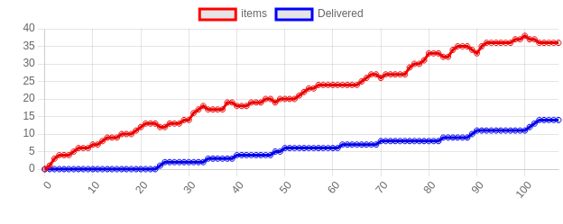
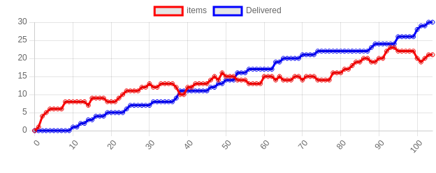
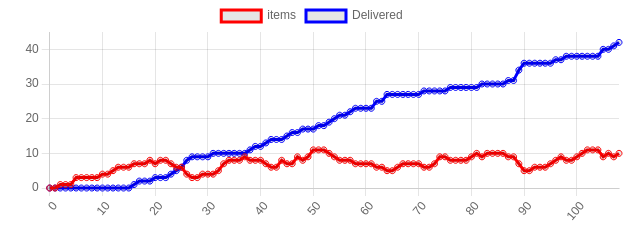
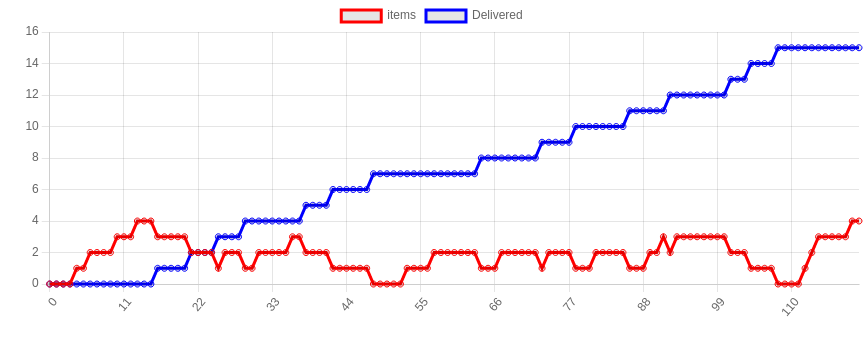
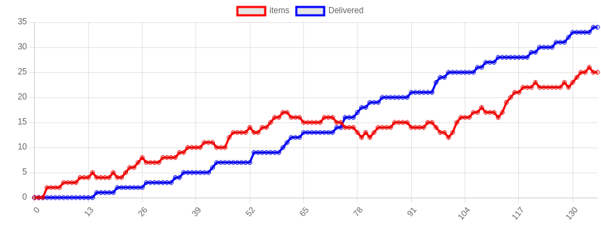
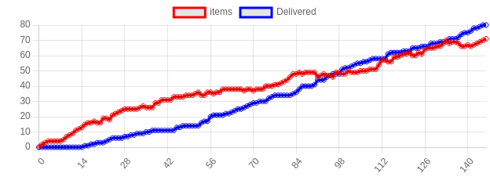
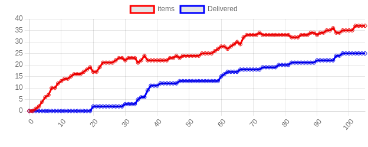
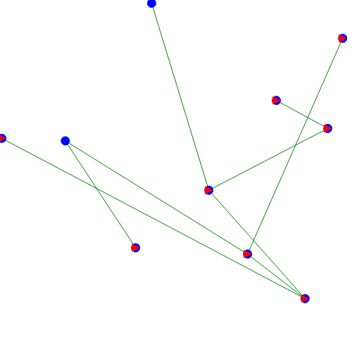
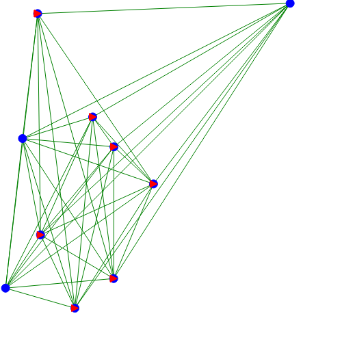

##Question 1:
- continu: les agents (vaisseaux) se déplacent dans l'espace qui est un environnement continu avec donc un nombre d'états possible infini.
- non épisodique : considérons un envoi d'item (du départ de l'item à l'arrivée sur une autre planète) comme un épisode. Après chaque envoie, le système revient dans un état initial "d'attente" différent du précédent car le vaisseau chargé du transport ne se trouve plus sur la même planète. Donc un épisode dépend des précédents.
- déterministe : dans notre cas, un vaisseau envoyé arrive forcément à destination (pas de crashs) donc nous connaissons à l'avance le résultat de chaque action.
- accessible : à tout moment, chaque agent sait où il se trouve et a accès à la position des autres agents (typiquement, le planète manager peut faire le tri entre les ships dont la position correspond à sa planète et les autres).
- statique : si les agents (ships et planetManagers) ne font rien, le système n'est pas modifié.

##Question 2 :
Les objets transportés ne sont pas des agents car ils n'en respectent pas les caractéristiques ;
- ils ne sont pas proactifs : si personne n'intéragit avec eux, rien ne se passe.
- ils ne sont pas autonomes vis-a-vis des autres éléments du système puisque leur position dépend uniquement de l'action d'autres agents.
- ils ne sont pas adaptables : ils ne sont pas capables de prendre en comptes les changements de l'environnement.

##Question 3:

Paramètre n°1 : nombre de vaisseaux

Plus le nombre de vaisseaux augmente, plus le nombre d'items livrés augmente rapidement et plus le nombre d'items dans le systeme reste faible. Intuitivement, cela se comprend car plus le nombre de vaisseaux est important, plus il est probable qu'un vaisseau soit disponible pour prendre en charge le nouvel item.

Courbe 1 :

Paramètres : n_vaisseaux = 3 / n_planètes = 10

Courbe 2 :

Paramètres : n_vaisseaux = 10 / n_planètes = 10

Courbe 3 :

Paramètres : n_vaisseaux = 20 / n_planètes = 10

Paramètre n°2 : nombre de planètes

Plus le nombre de planètes augmente, plus le nombre d'items dans le système augmente rapidement dans le temps. Autrement dit, plus il y a de planètes, moins les vaisseaux sont capables de répondre à la demande et donc, plus le nombre d'objets en attente dans le système augmente.

Courbe 4 :

Paramètres : n_vaisseaux = 10 / n_planètes = 3

Courbe 5 :

Paramètres : n_vaisseaux = 10 / n_planètes = 10

Courbe 6 :

Paramètres : n_vaisseaux = 10 / n_planètes = 20

Courbe 7 :

Paramètres : n_vaisseaux = 10 / n_planètes = 30

Conclusion : 

On pourra donc conclure que :
- avec plus de vaisseaux que de planètes, on arrivera globalement à maintenir le nombre d'items dans le système assez bas. Nous aurons donc une augmentation lente du nombre d'items et une augmentation rapide du nombre d'items livrés.
- avec plus de planètes que de vaisseaux, on n'arrivera pas à gérer l'afflux de nouveaux items. Nous aurons donc une augmentation rapide du nombre d'items dans le système et une augmentation rapide du nombre d'items livrés.

##Question 4:

Ici, l'organisation du système est basée sur une valeur d'utilité (des vaisseaux par rapport à un item à livrer). En prenant en compte que nous avons crée un Contrat Net Protocol, on peut dire que notre système repose sur un modèle d'agents coopératifs. 

##Question 5:
La réponse est presque identique à la celle de la question 1. Seulement, l'environnement n'est plus statique mais dynamique car maintenant, même sans action des agents, le système est parfois modifié.

##Question 6:
En fonction des "conditions de circulation", les agents sont obligés de modifier leur vitesse voir de s'arrêter en cours de livraison et quand cela est possible, de choisir un autre itinéraire. Cela correspond à l'adaptabilité des agents.

##Question 7 :
On remarque que, pour un paramétrage similaire, les délais de livraison sont généralement plus long et donc, le nombre d'items en attente est beaucoup plus conséquent. 

Courbe 8 :

Paramètres : n_vaisseaux = 15 / n_planètes = 20

##Question 8 (bonus) :

Le facteur ROAD_BRANCHING_FACTOR permet de gérer la probabilité qu'une route soit crée à l'initialisation du système. Lorsque ROAD_BRANCHING_FACTOR est proche de 0, il existe très peu de connections entre les planètes et donc, le nombre de d'items livrés augmente beaucoup plus doucement. En effet, le trajet entre deux planètes est en général plus long et donc il faut plus de temps à un vaisseau pour réaliser une livraison. A l'inverse, lorsque ROAD_BRANCHING_FACTOR est proche de 1, les planètes sont presque toutes reliées directement les unes aux autres. Les trajets sont donc directs et très rapide et donc le nombre d'items livrés augmente rapidement. 

Courbe 8 :

Paramètres : n_vaisseaux = 10 / n_planètes = 30 / road_branching_factor = 0.1

Courbe 9 :

Paramètres : n_vaisseaux = 10 / n_planètes = 30 / road_branching_factor = 0.9
