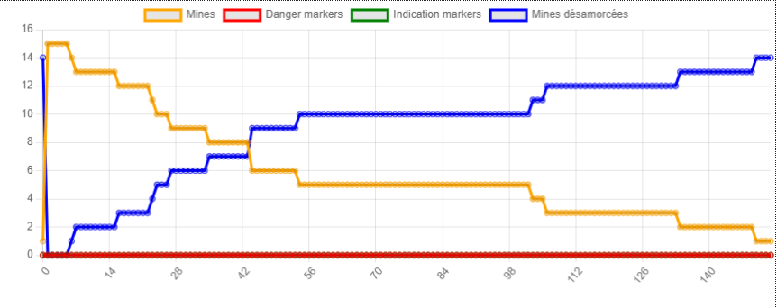
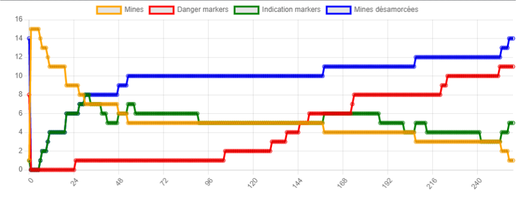
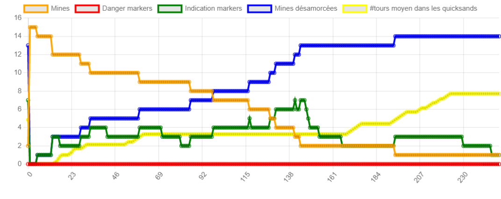
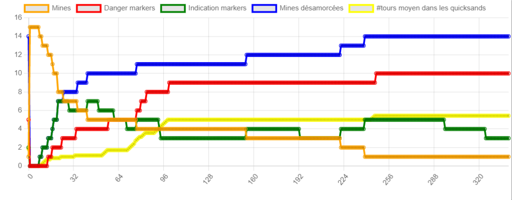

## Question 1

Au cours de cette modélisation, nous allons utiliser des agents réactifs. En effet, nous n'avons besoin d'aucune planification mais seulement d'obtenir des réponses adéquates à des événements extérieurs.
Une architecture par niveaux (subsomption) semble donc la plus appropriée afin de favoriser certaines actions.

## Question 2

Dans une architecture, les niveaux les plus bas sont les plus prioritaires. Je propose donc l'architecture suivante :

- Niveau 0 : éviter obstacles/autres robots/bords de la zone (détecte un obstacle, un robot ou un bord --> change de direction)

- Niveau 1 : Désamorcer une mine (détecte une mine + est placé au-dessus --> désamorce la mine)

- Niveau 2 : Se diriger vers une mine (détecte une mine + est loin --> se dirige vers la mine)

- Niveau 3 : Se déplacer (incluant le changement aléatoire de direction)

Afin de compter l'ensemble des mines désarmorcées, j'ai ajouté une variable disarmed_mines dans le model qui est incrémentée à chaque destruction de mine. Nous obtenons le graphe suivant :

Nous obtenons pour 10 lancements les temps de désamorçages complets suivants : 154 / 205 / 152 / 88 / 112 / 149 / 213 / 253 / 164 / 169
D'où une moyenne de 165.9 frames.

## Question 3

Les agents réactifs sont définis par 3 grandes caractéristiques : modularité, simplicité et l'absence de modèle. Dans notre cas, nous pouvons dire, pour chacune :

- modularité : la modularité n'est pas tout à fait respectée. Dans l'ensemble, chaque tâche dans notre organisation correspond à un comportement précis sauf pour le niveau 0 où 3 tâches ont été fusionnées (éviter un obstacle, éviter un robot et éviter les bords du plateau).

- simplicité : la simplicité est tout à fait respectée car nos agents ne réalisent aucun traitement des "mesures" de leur environnement. Une perception implique une action dès lors que les critères sont respectés.

- absence de modèle : cette caractéristique est tout à fait respectée car les données issues des capteurs sont traitées sans aucun 'post-traitement'.

## Question 4

Dans une architecture réactive, aucun traitement des données n'est réalisé. Une même mesure entraîne systématiquement une même action. Ainsi, la perception des balises est implémentée, le robot détectera systématiquement la balise qu'il vient de déposer et agira en conséquence ce qui entraîne un comportement absurde (poser une balise puis la ramasser dès l'instant d'après). 
La seule manière d'éviter ce problème sans avoir besoin de traitement est donc d'inhiber la perception du robot aux balises afin qu'il n'en tienne pas compte.

## Question 5

Nous allons suivre une même architecture en ajoutant des niveaux concernant les balises :

- Niveau 0 : Eviter obstacles/autres robots/bords de la zone (détecte un obstacle, un robot ou un bord --> change de direction)

- Niveau 1 : Désamorcer une mine et déposer une balise INDICATION (détecte une mine + est placé au-dessus --> désamorce la mine et pose une balise DANGER)

- Niveau 2 : Déposer une balise DANGER (sort d'un sable mouvant --> dépose une balise DANGER)

- Niveau 3 : Se diriger vers une mine (détecte une mine + est loin --> se dirige vers la mine)

- Niveau 4 : Faire demi-tour (détecte une balise DANGER --> fait demi-tour)

- Niveau 5 : Ramasser une balise INDICATION et tourner à 90° (détecte une balise INDICATION --> se dirige à la perpendiculaire de la direction indiquée)

- Niveau 6 : Se diriger vers une balise INDICATION (détecte une balise INDICATION --> se dirige vers la balise)

- Niveau 7 : Se déplacer (incluant le changement aléatoire de direction)

Afin de prendre en compte les nouveaux changements, j'ai choisi cette structure. Détecter des obstacles/robots/bords reste la plus grande priorité puis la détection et le déminage vient juste après. J'ai décidé de placer tout ce qui relève des balises après car selon moi, il vaut mieux ne pas respecter une balise si cela permet de désamorcer une bombe. Par exemple, un robot devra s'engager dans un sable mouvant malgré une balise DANGER s'il y a une mine dedans, ce qui me paraît plus cohérent.

Enfin, j'ai hésité à mettre le dépôt de balises DANGER dans les niveaux car l'action se fait sans concurrence avec les autres. Par exemple, lorsque l'on sort d'un sable mouvant, on dépose une balise que l'on soit ou non en train d'aller vers une mine ou en train d'éviter un obstacle. Ainsi, l'action n'entrant jamais en contradiction avec une autre, il est difficile de la prioriser. Autrement dit, elle arrivera toujours sans gêner une autre action. J'ai décidé de la placer à ce niveau car, tel que je l'ai codé, le dépôt de balise se fait avant tout mouvement et donc, est toujours "priorisé" par rapport à n'importe quelle action de déplacement.

## Question 6

Voici un graphe exemple avec les balises :

Après 10 simulations, nous obtenons un temps moyen de 217.6 (260 / 161 / 64 / 178 / 193 / 230 / 215 / 266 / 217 / 392). Avec la prise en compte des balises, il arrive beaucoup fréquemment qu'une mine se retrouve dans une zone "isolée", cachée derrière des sables mouvants ce qui la rend plus difficile d'accès et ce qui a tendance à faire augmenter le temps moyen de déminage complet.

## Question 7

Pour cette question, j'ai simplement ajouté un compteur permettant d'additionner le nombre moyen de tours passés dans les sables mouvants par robots (compteur total / nb_robots). 

Sans la prise en compte des balises, nous avons :

Nous avons quasiment 8 tours passés dans les quicksands par robot.

En prenant en compte les balises DANGER :

Nous avons maintenant une moyenne d'environ 5,5 tours passés dans les quicksands. L'ajout de balise a bien l'effet escompté : éviter que les robots n'aillent dans les sables mouvants.

## Question bonus

